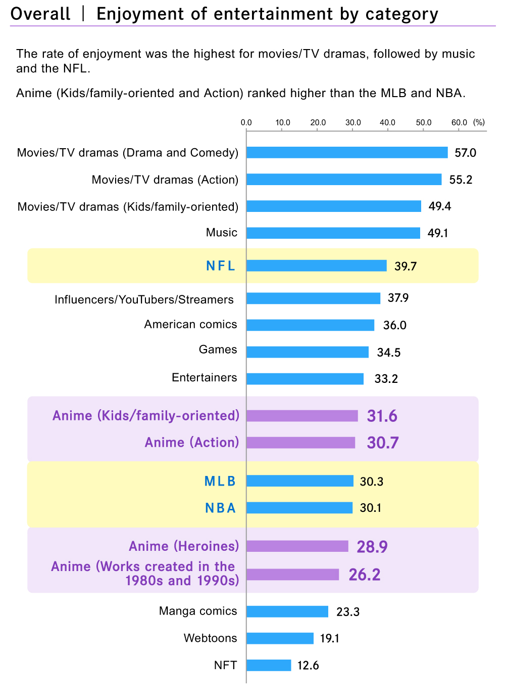
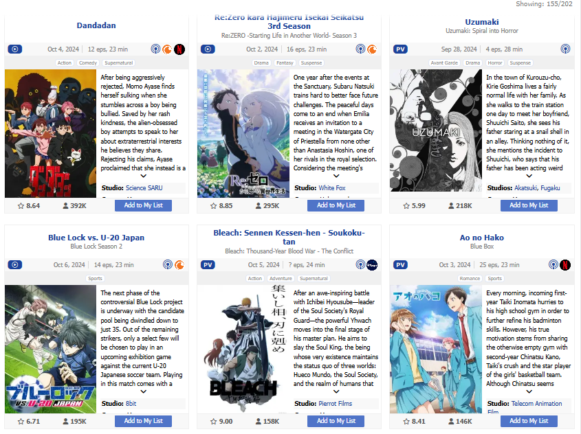
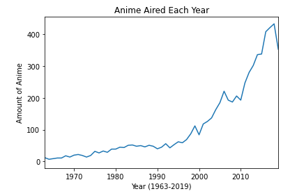
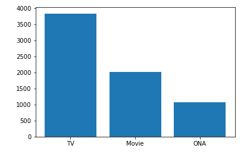
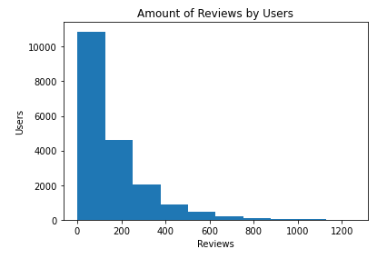

# Anime Recommendation
## Author
Jackson Robbins: https://github.com/Jmanitou
## Overview
Here is the [presentation](https://docs.google.com/presentation/d/1wMxyKGHZa28VmZYhw6aPmIk89Zt86lxi4fLpRSPwyyw/edit?usp=sharing).
## Business Problem
I am working with a client who is a business that wants to recommend anime to someone who already watches anime and wants to find more to watch. With anime becoming more popular throughout the years and more anime being produced each year, it is getting harder and harder to find the right one to watch in a sea of media. <br/>
## How does Anime relate to other Media in terms of Interest?


## Data Source
The data was sourced from [My Anime List](https://www.kaggle.com/datasets/hernan4444/anime-recommendation-database-2020/discussion?sort=hotness), which is a site that allows users to log the anime they have watched, dropped or are planning to watch. The data is up to date till February 2020. The data contains 17,562 different anime and 325,772 different users, with a combined total of 109,224,747 reviews. <br/>

## Results
The code was able to predict a user's rating within a 1.2 error. Then it was able to recommend 5 different anime that a user might want to watch.
## Project Structure
```
├── data
│   ├── MyAnimeList.csv
│   └── MyAnimeList.csv
├── images
│   ├── AnimeAllType.PNG
│   ├── AnimeRemovedType.PNG
│   ├── AnimeYear.PNG
│   ├── FallAnime.PNG
│   ├── GenzInterest.PNG
│   └── ReviewsbyUser.PNG
├── .gitignore
├── README.md
├── Presentation.pdf
└── Anime_Recommendation.ipynb
```

## Visualizations
 <br/>
 <br/>

## Conclusions
We decided to use SVD for our algorithm as it had the best value of RMSE at about 1.2. From there we were able to recommend 5 different anime a user might want to watch.
## Next Steps
1. Streaming Service: Further filter out anime that isn’t in our streaming service as it wouldn't make sense to recommend or look at anime that isn't ours.
2. Demographics: See how age and gender affect recommendations and how we can use that to better recommend.
3. Merch: See how we can advertise merch based on their reviews to make a larger profit margin
